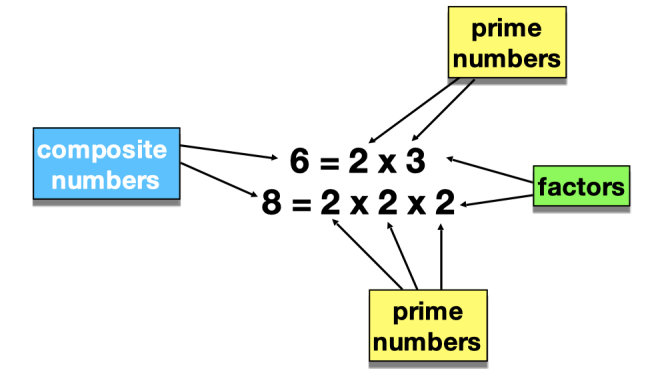

# Kata Prime Factors

## Description
Le kata "Prime Factors" consiste à développer la décomposition d'un nombre en facteurs premiers avec une approche TDD.

## Fonctionnalités
Les **facteurs premiers** d'un entier sont les nombres premiers qui, lorsqu'ils sont multipliés ensemble, donnent l'entier original.

Dans le kata **Prime Factors**, vous allez écrire une routine qui prend un argument - un entier positif, non nul - et renvoie une liste des facteurs premiers de l'entier. Si l'entier n'a pas de facteurs premiers, renvoyez une liste vide. 

**Utilisez le TDD pour réaliser le kata.**

## Prérequis
- Docker

## Installation
- Cloner le dépôt
- `make build`
- `make start`
- `make sh` + `composer install` dans le container (puis exit)

## Tests
- `make test`

## Sources
- https://www.dunod.com/sciences-techniques/software-craft-tdd-clean-code-et-autres-pratiques-essentielles
